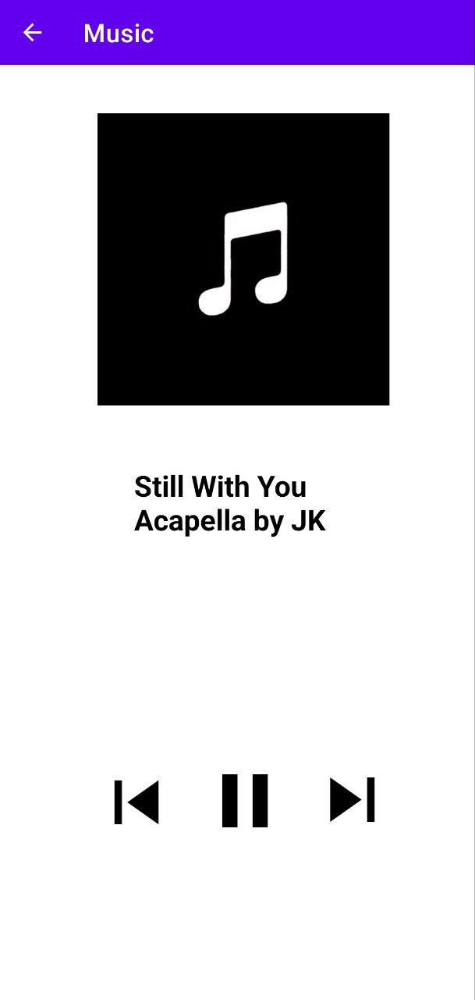

# Music_Player

# This Music Player is built using Android Studio
By using two activities 
- activity_main.xml
- activity_play_song.xml
                          
# In the AndroidManifest.xml file add the user permission right after the <manifest> tag and put it as 
 `< uses-permission android:name="android.permission.READ_EXTERNAL_STORAGE" /> `
  
# In the build gradle module file 
add the third-party dependencies as
implementation 'com.karumi:dexter:6.2.3'   --> Copy paste this into the dependencies section

# Screenshot
Here we have the project screenshot :

.jpg)

Futher features can be added as you wish
Hope this might be helpful to you
Thank You :):
